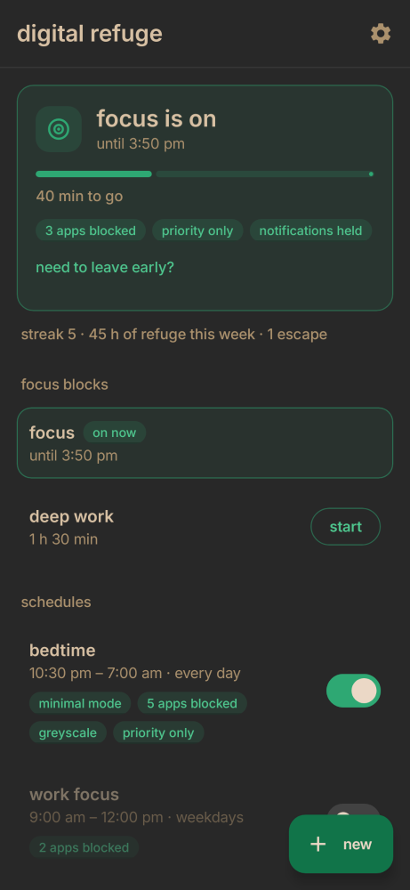
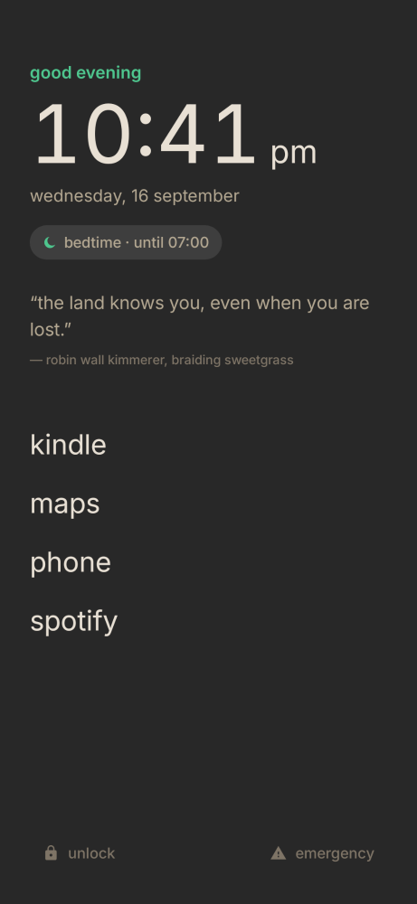
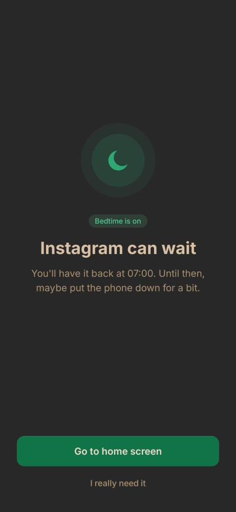
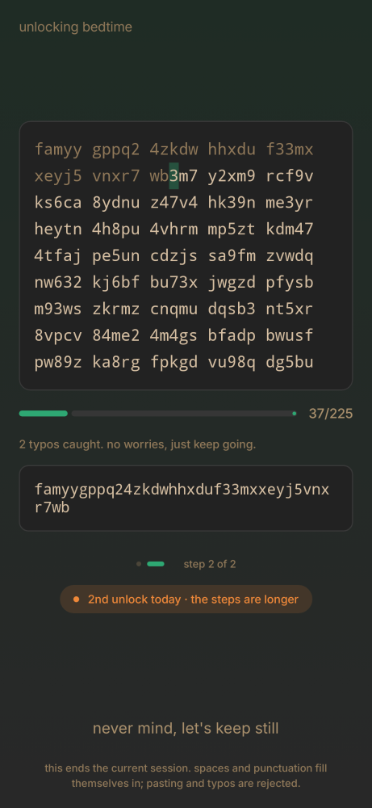
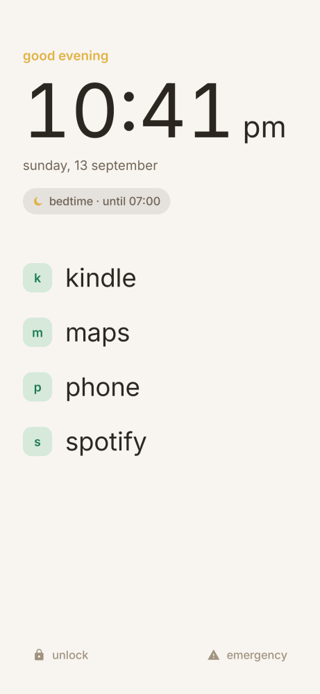

> **DISCLAIMER: This app was entirely coded by Claude**, I've primarily been testing the app and provided improvement suggestions.
Contributions from the open-source community of developers are extremely welcome.

# digital refuge

A calm, [primary](https://primary-theme.github.io/start-here/)-styled Android app that gives you a refuge from your phone. On a schedule, or for an on-demand focus block, it can:

- **block distracting apps**: a gentle full-screen cover appears over them;
- **swap your home screen for a minimal launcher** where only the apps you choose can be opened. Its colours, text size (app names down to very small, so many apps fit) and what it shows are yours to customize;
- **quiet the phone** with Do Not Disturb ("Priority only" or "Silence") and **hold notifications back** until the session ends. Media and alarms are never muted, so music, videos and alarms keep playing.

<p>
  
  
  
  
  
</p>

## Features

- **Schedules and focus blocks.** Schedules repeat on days and times. Blocks start whenever you like and run for a set length.
- **Templates**, always available from **New**:
  - schedules: Bedtime, Work focus, Slow morning, Weekend detox;
  - blocks: Focus 60, Deep work 90, Pomodoro 25, Study 45.
- **Leaving early takes effort**, Cold Turkey style. Stack any mix of steps, completed in this order:
  1. wait out a timer (it only runs while its screen is open, and starts over if you back out);
  2. type random text (no pasting, no typos);
  3. enter a password.

  Each schedule decides whether unlocking **ends the session** or **pauses it for N minutes**. Optionally, the text gets 50% longer with each early unlock in a day.
- **No quick escapes mid-session.** While a session is running, you can't edit or delete its schedule. If Do Not Disturb is switched off from quick settings, the app switches it straight back on and tells you why.
- **A calm lock screen.** During a session, the lock screen shows your home style's clock, date and session, without the apps. Tap it to unlock as usual (PIN, fingerprint…). You can switch it off in the minimal home screen settings.
- **A quote of the day** on the minimal home and lock screen: 34 lines on attention, nature and the sacred, from Thoreau, Emerson, the Buddha, Kimmerer, Weil, Dillard and others, each checked against its source ([docs/quotes-review.md](docs/quotes-review.md)). A new one each day; tap it on the home screen for another. Switch it off in the minimal home screen settings.
- **A lotus in the status bar** while a session runs, with a countdown in the notification. It's silent and stays visible even when notifications are hidden.
- **Emergency button** on the minimal home screen, which keeps the session in place. It offers calling someone, and your **always-available apps** (maps, rides, authenticators…), which no session ever blocks.
- **Easy number picking:** tap − or + for one step, hold to keep going faster, or tap the number to type a value or pick a preset.
- **Safer defaults:** Settings, Phone and Messages start out allowed in minimal mode, and the app picker explains why.
- **App groups** ("Social & feeds", "Essentials", or your own) let you tick many apps in one tap.
- **Stats:** a streak, time spent in refuge this week, and early unlocks.
- **Quick Settings tile** that starts your favourite focus block.
- **Home-screen widget** that starts a chosen block with one tap, and shows how long is left while it runs. Add one from settings → home-screen widget, or long-press your home screen → widgets → digital refuge.
- **Design:** based on the [Primary](https://primary-theme.github.io/start-here/) Obsidian theme, with green accents and the Inter font. Dark mode uses neutral grays around `#282828`; light mode uses Primary's cream palette. All text in the app is lowercase, and the icon is a lotus, the Buddhist image of calm, with a warm centre petal rising from the water.

## Install

digital refuge installs from an APK file, like any app downloaded outside the Play Store:

1. On your phone, download **digital-refuge.apk** from the [latest release](../../releases/latest).
2. Open it. If Android asks, allow your browser (or files app) to install unknown apps.
3. Tap **Install**. Google Play Protect may say it doesn't recognise the app; choose *Install anyway*.

Updates install the same way, over the previous version, and keep your schedules.

## First launch

Open the app and follow **settings → permissions & setup**, which shows the status of each step:

1. **Let digital refuge see which app is open (required).** This is what lets it block apps and run the minimal home screen. Turn on *digital refuge blocker* in Settings → Accessibility. On Android 13 and newer, apps installed from an APK are "restricted" at first, so if the switch is greyed out:
   1. Go to App info → digital refuge → ⋮.
   2. Tap **Allow restricted settings**.
   3. Try the switch again.
2. **Do Not Disturb access (optional):** needed for silencing the phone and holding notifications back. On Android 15 and newer it also enables greyscale.
3. **Notifications (optional):** lets the lotus appear in the status bar during sessions.
4. **Always-available apps (recommended):** choose the few apps that stay usable during every session, like maps, rides or your authenticator. You reach them from the emergency button, and can change them later in settings → emergency.
5. **Battery:** if blocking stops after a while, set the app's battery usage to *Unrestricted*. Some phone makers aggressively stop background apps.

**Banking and ID apps.** Some, like BankID, refuse to run while an accessibility service is on, because malware abuses that permission. digital refuge's service only sees which app is open and can't read the screen. If an app still refuses, switch *digital refuge blocker* off in Settings → Accessibility while you use it, then back on.

**Last resort,** if you're ever truly stuck: restart the phone in safe mode (power menu → press and hold *Power off*). Downloaded apps don't run there, so you can uninstall digital refuge like any other app.

## Extra: greyscale

Sessions can also fade apps to black and white, while your minimal home screen stays in colour. Everything else works without it.

**On Android 15 and newer, no computer is needed:** once Do Not Disturb access is allowed, greyscale runs through a "digital refuge greyscale" mode (Settings → Modes, the same system as Do Not Disturb and Bedtime).

On older versions, Android doesn't let apps switch greyscale on by themselves, so this one feature needs a permission granted once from a computer:

1. On the phone, turn on USB debugging (Settings → About phone → tap *Build number* 7 times → Developer options → USB debugging).
2. On the computer, get Google's small [platform-tools](https://developer.android.com/tools/releases/platform-tools) download, which contains `adb`.
3. Plug in the phone and run:

   ```sh
   adb shell pm grant app.bedtime android.permission.WRITE_SECURE_SETTINGS
   ```

The permission survives reboots and updates. If you use colour correction yourself, your own setting comes back after each session.

## Development

Build from source with [Android Studio](https://developer.android.com/studio), or any machine with the Android SDK and JDK 17:

```sh
./gradlew installDebug           # build and install on a connected phone
./gradlew assembleDebug          # just build the APK: app/build/outputs/apk/debug/app-debug.apk
./gradlew testDebugUnitTest      # logic tests: schedules, stats, challenges, DND policy…
./gradlew recordPaparazziDebug   # renders every screen, dark and light, to app/src/test/snapshots/images/
./gradlew verifyPaparazziDebug   # fails if a screen changed unexpectedly
./gradlew lintDebug
```

The screens are checked with [Paparazzi](https://github.com/cashapp/paparazzi) screenshots rather than an emulator. Every screen has a stateless `…Content` composable, which is what the screenshot tests render.

| Piece | Where |
|---|---|
| Models and storage (JSON in DataStore) | `data/Models.kt`, `data/Repository.kt` |
| Templates, app groups | `data/Templates.kt`, `data/Groups.kt` |
| Pure "what's active now" logic (midnight crossing, blocks, overrides) | `engine/ScheduleEvaluator.kt` |
| Live state, re-evaluated at each boundary | `engine/Engine.kt` |
| Stats and streaks | `engine/Stats.kt` |
| Foreground-app watcher: blocking, minimal mode, greyscale, Do Not Disturb | `service/BlockerService.kt` |
| Greyscale and Do Not Disturb | `service/GreyscaleController.kt`, `service/ModeGreyscale.kt` (Android 15+), `service/DndController.kt` |
| Quick Settings tile | `service/FocusTileService.kt` |
| Lock screen during sessions, status-bar notification | `ui/lock/LockScreenActivity.kt`, `service/SessionNotifier.kt` |
| Home-screen widget | `ui/widget/` |
| Unlock challenges and escalation | `unlock/` |
| Screens and the Primary-based theme | `ui/` |

The internal package name is still `app.bedtime`, from the app's first name, so updates install over existing copies.

**Strictness is deliberately moderate.** There's no Device Admin, and Android doesn't let any app lock you out of Settings. A determined person can always switch the accessibility service off. The app is designed to add friction to impulses, not to be a prison.
